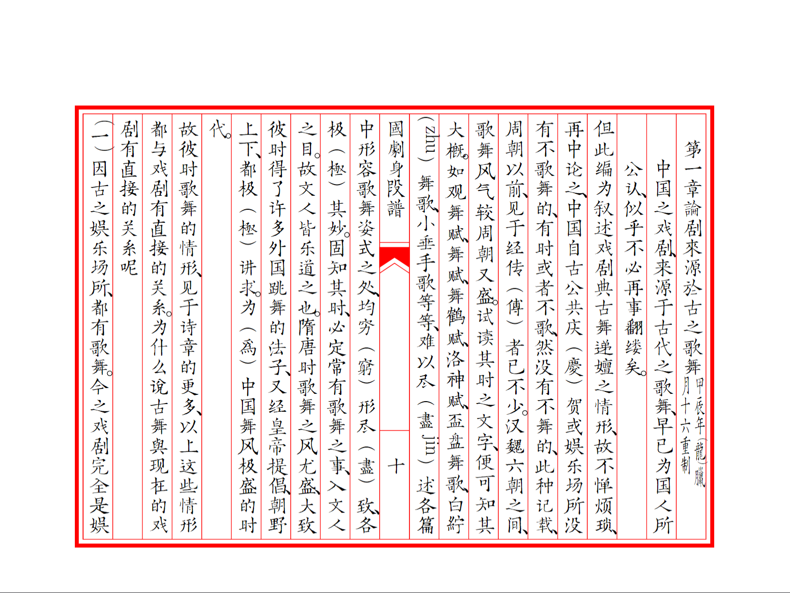
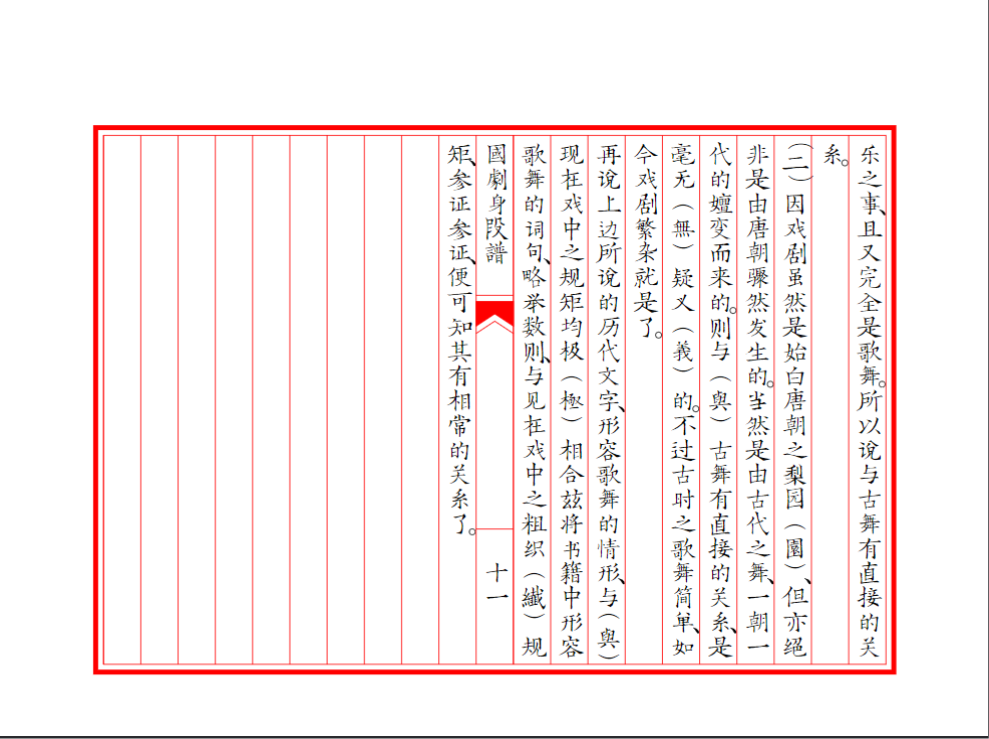

[toc]

git config --global http.proxy http://127.0.0.1:10809
git config --global https.proxy http://127.0.0.1:10809
- [序](#序)
- [第一章 論剧來源於古之歌舞](#第一章-論剧來源於古之歌舞)
    - [乐记：“乐者，心之动也；声者，乐之象也；文采节奏，声之饰也。君子动其本，乐其象，然后治其节，是故先鼓以警戒。”云云。](#乐记乐者心之动也声者乐之象也文采节奏声之饰也君子动其本乐其象然后治其节是故先鼓以警戒云云)
    - [陈澔集说云：“动其本，心之动也；心动而有声，声出而有文釆节奏，则乐饰矣。乐之将作，必先击鼓，以耸动众听，故日先鼓以警戒。舞之将作，必先三举足，以示其舞之方法。”云云。](#陈澔集说云动其本心之动也心动而有声声出而有文釆节奏则乐饰矣乐之将作必先击鼓以耸动众听故日先鼓以警戒舞之将作必先三举足以示其舞之方法云云)
    - [乐记日：“诗言其志也；歌咏其言也；舞动其容也。”](#乐记日诗言其志也歌咏其言也舞动其容也)
    - [周礼郑注日：“乐之声音节奏，未足以感动人而舞之发扬蹈（厲li）为足以动人。”](#周礼郑注日乐之声音节奏未足以感动人而舞之发扬蹈厲li为足以动人)
    - [诗序曰：“咏歌之不足，不知手之舞之，足之蹈之，引用《乐记》盖乐心内发,感物而动,不觉自运欢之至也.此舞之所由起也。”](#诗序曰咏歌之不足不知手之舞之足之蹈之引用乐记盖乐心内发感物而动不觉自运欢之至也此舞之所由起也)
    - [刘慷舞议日：“舞之容，生于辞者也。”](#刘慷舞议日舞之容生于辞者也)
    - [傅毅舞赋曰：“其始兴也，若俯若仰，若来若往，雍容惆怅，不可为象。”](#傅毅舞赋曰其始兴也若俯若仰若来若往雍容惆怅不可为象)
    - [舞赋又曰：“其少进也，若翔若行，若竦若倾，兀动赴度，指颖应声。”](#舞赋又曰其少进也若翔若行若竦若倾兀动赴度指颖应声)
    - [唐朝无名氏霓裳羽衣曲赋云：“趋合规矩步中圆方。”](#唐朝无名氏霓裳羽衣曲赋云趋合规矩步中圆方)
- [第二章 論放劇與唐朝之舞有密切關係](#第二章-論放劇與唐朝之舞有密切關係)
- [第三章 論戲劇之身段](#第三章-論戲劇之身段)
  - [第一節（节）  袖谱](#第一節节--袖谱)
  - [第二節（节）  手谱](#第二節节--手谱)
  - [第三節（节）  足谱](#第三節节--足谱)
  - [第四節（节）  腿谱](#第四節节--腿谱)
  - [第五節（节）  腰谱](#第五節节--腰谱)
- [第四章論戲剧之身段](#第四章論戲剧之身段)
  - [第一節（节）  鬍鬚谱](#第一節节--鬍鬚谱)
  - [第二節（节）  翎子谱](#第二節节--翎子谱)

# 序

佘研究戏中之身段，已二十佘年。从前对动作有不分明的地方，辄请问于梨园老辈俱蒙热心相告。凡有见闻，必记于小册，分类编成；日久积蓄颇多，恒欲撰为一书，以公同好。

去冬稍暇，即取小册，分类编成;又凭记忆所及，添入若干条。草就之后，即就正于梅君浣华，梅君又添出若干条。后又讲盆于徐君兰园，又为添出多条。于是将二君所说者，分别列入各类之中，书遂成。

但恐错谬太多。又求教于萧长华、叶春善、余叔岩、王瑶卿诸君，蒙其指正之处，亦复不少适(適)本会丛(叢)刊第二期出版，卽以此付印其中。名词及各角(脚、腳jiao)身段之作法,当（當）仍有不切當之处（處）;

然以上诸君亦助余费若干心血矣。徐君兰园指示尤多，特书于此，以𰵧（誌）不忘，以后仍望高明，有以（敎jiao）之也。

但有一（節jie），余不能不郑重说明者：若人人都照这本书的写（寫）法去表演，纵然一丝不走，究竟千人一面，不但太科学化，有背美术（術）之原则，而且岂（豈qi）不太板滞，太机械，而毫无美趣了么？翻过来再从一方面说，比方以抖袖一（節jie）而论，可以算是板简单的身段了；但是古今诸位名脚抖的时候，是一人一个样，一出一个样，更可以说是一次一个样，而皆能美观。

果如此说，那规矩岂不没用了么（厯li）？却是我深信在当人手初学的时候，则必须照规矩来学，所谓不以規矩不能成方圆，以後則须神而明之，存乎其人，不可食古不化也。

    民國二十一年春高陽齊如山識

# 第一章 論剧來源於古之歌舞

中国之戏剧，来源于古代之歌舞，早已为国人所公认，似乎不必再事翻缕矣。

但此编为叙述戏剧典古舞递嬗之情形，故不惮烦琐，再中论之，中国自古公共庆（慶）贺或娱乐场所没有不歌舞的，有时或者不歌，然没有不舞的，此种记载，周朝以前，见于经传（傅）者已不少。汉魏六朝之间，歌舞风气较周朝又盛。试读其时之文字，便可知其大概。如观舞赋，舞赋，舞鹤赋，洛神赋，杯盘舞歌，白紵（zhu）舞歌，小垂手歌等等；难以尽（盡jin）述各篇中形容歌舞姿式之处，均穷（窮）形尽（盡）致，各极（極）其妙。固知其时，必定常有歌舞之事，入文人之目。故文人皆乐道之也。隋唐时歌舞之风尤盛，大致彼时得了许多外国跳舞的法子，又经皇帝提倡，朝野上下，都极（極）讲求。为（為）中国舞风极盛的时代。

故彼时歌舞的情形，见于诗章的更多，以上这些情形都与戏剧有直接的关系。为什么说古舞與现在的戏剧有直接的关系呢？

(一)因古之娱乐场所，都有歌舞。今之戏剧完全是娱乐之事，且又完全是歌舞。所以说与古舞有直接的关系。

(二)因戏剧虽然是始白唐朝之梨园（園），但亦绝非是由唐朝骤然发生的。当然是由古代之舞，一朝一代的嬗变而来的。则与（與）古舞有直接的关系，是毫无（無）疑义（義）的。不过古时之歌舞简单，如今戏剧繁杂就是了。

再说上边所说的历代文字，形容歌舞的情形，与（與）现在戏中之规矩均极（極）相合兹将书籍中形容歌舞的词句，略举数则，与见在戏中之粗织（織）规矩，参证参证，便可知其有相常的关系了。
<!--  -->

<!--  -->

### 乐记：“乐者，心之动也；声者，乐之象也；文采节奏，声之饰也。君子动其本，乐其象，然后治其节，是故先鼓以警戒。”云云。

### 陈澔集说云：“动其本，心之动也；心动而有声，声出而有文釆节奏，则乐饰矣。乐之将作，必先击鼓，以耸动众听，故日先鼓以警戒。舞之将作，必先三举足，以示其舞之方法。”云云。

这一段文字，与戏中之情形，有极相似的地方。

比方戏中之起唱工，必系心内有所感触而起，或于自己思想事情的时候，或于听人述说事情的时候，心中有所感动，此时必定发出一种声音动作，作为 “叫（呌）板”， 如云 “呀哎” ，或说 “不好了”，等等。或一抖袖，或一顿足，都可以作为叫（呌）板之表示。脚色一呌板，乐即起奏，这就是“乐者，心之动也。”的意思。

场面囗v-v囗一听演员如何呌板，或喜怒，或哀乐等等，便知道该起什么样的唱工。此时锣鼓怎样的起法，琴笛等等怎样的奏法，哀有哀调，喜有喜调，这便是“声者，乐之象也。” 唱工起后，琴笛怎样烘托唱者，休息的时候，音乐怎样的补垫，如大小过门等等。

再于歌唱之时，偶有身段，亦须添加一两下锣鼓，为的显着活动这便是“文采节奏，声之饰也。”

拉过门之前，必先起锣鼓，这便是“乐之将作，必先击鼓以怂众听”的意思。

演员出场之时，在门帘外必先有整衣转身等身段，后再往前行，这就是“舞之将作，必先三举足，以示其舞之方法”的意思。

### 乐记日：“诗言其志也；歌咏其言也；舞动其容也。”

戏中先是说白，说到心中有所感动之后，精神一震，便起唱工。

这个意思，〇只是说白觉得不解气了，非拉起嗓子唱一段，才觉养舒气痛快，这便是“歌咏其言也”。

起唱工之后，唱的词句是什么意思，必用手指点出来，唱到痛快淋漓的时候，必用手足全身来形容，他这些指点形容的举动，戏界都名之日身段，即是舞的原理，这就是“舞动其容也”。

### 周礼郑注日：“乐之声音节奏，未足以感动人而舞之发扬蹈（厲li）为足以动人。”

戏界最重作工，什么叫作工呢？就是用手眼身法步，把唱歌句中的意思，都给形容出来，以便观客容易明瞭。所以成中于此地方，非常的注意，演员非精于此不可。比如演员如果作工好，就是嗓子不好，唱的差一点，观客也是欢迎的。他仍然可以出名。倘若该演员没有作工，专靠唱，那就非唱的极好不可。但他的享名，总不及有作工的演员欢迎的人较多。

本界的人，对于有作工的演员，尤为重视。因为有作工的演员，能够傅情，能够把本人的情绪，词句中的意思都给形容出来。观客看着容易提神，容易感动，所以大家特别的欢迎。比方贾洪林后半辈，就是全靠作工吃饭，这就是‘舞之发扬蹈厉（厲li）为足以动人”的意思。

### 诗序曰：“咏歌之不足，不知手之舞之，足之蹈之，[引用《乐记》](https://ctext.org/liji/yue-ji/zhs)盖乐心内发,感物而动,不觉自运欢之至也.此舞之所由起也。”

戏中常最初起唱的时候，往往不作身段，唱过一二句之后，虽作身段，亦只以手指示之。及至唱到酣畅淋漓的时候。便用股肱手足，全身的动作来形容。他在这个时候腔调板眼也快了，手足的动作，自然而然的也就快了。这便是“不知手之舞之，足之蹈之，乐心内发，感物而动，不觉自运欢之至也。”的意思。

### 刘慷舞议日：“舞之容，生于辞者也。”

戏中于念白，或歌唱的时候，必须将制句中的意思，形容出来。如武家坡说：“全凭皓月当空”或唱“八月十五月光明”的时候，必伸两手作圆月式，以形容之。昆（崑）曲中对于此等地方，句句要形容，处处须认真，不必尽举。鄙人为梅兰芳所安身段，如奔月，散花，别姬等等；每一种舞式，均与词句关合，绝没有随便任意乱舞的时候。这就是“舞之容，生于辞者也”的意思。

### 傅毅舞赋曰：“其始兴也，若俯若仰，若来若往，雍容惆怅，不可为象。”

戏中演员，上场一出台帘（臺簾），先立住整整冠，糌绺须（鬚），抖抖袖，端端帯，欲行先不行，走一步又停一停，作种种姿式神情，这就是“其始兴也，若俯若仰，若来若往，雍容惆恨，不可为象。”的意思。由此更可知演员出场之后，时时刻刻，种种举动，皆系舞式也。

### 舞赋又曰：“其少进也，若翔若行，若竦若倾，兀动赴度，指颖应声。”

戏中之快板及急急风的走法，或走同场，如穆柯寨穆桂英上高台之前，须前走一圆场，及各脚（腳jiao）“趟馬”之跑圆场等等步法，都是脚下要快，上身要稳，走的好的，真同飞[（𮸽）（飝）](https://www.cidianwang.com/shufa/fei7819.htm)一样，非常的美观。这就是“若翔”的意思。

戏中如趟马（趟馬）或出场，将要快走的时候，初一皋步，腳动的虽快，而地方却（卻）不大移动，又像前走，又不像前走，此种脚步在趟马（趟馬）时用的尤多。又如穆桂英在抬脸转身（[臺臉𨍭身](https://www.cidianwang.com/shufa/tai7347_cs.htm)）后将上高台（臺）之前之几步，只举步不大移地方，也就是这种走法。这就是“若行”的意思。言其是欲行不行，似行非行也。合以上两种，也可以说又像飞（𮸽）又像走的让人捉揍不准。所以说是“若翔若行”，这也有理。

再者演员每逢亮高像的时候，必定手往上伸，越高越好看，仿佛一块细长的石头[（頭）](https://www.shufazidian.com/s.php)，立住的一样这便是“`若竦`”的意思。在亮矮像或卧于幕上，或斜身向前，或左侧右侧，彷佛将要倒下的一样，这便是“**`若倾`**”的意思。

言其是各种身段亮象，有时高有时矮，有时侧有时歪，种种变化，非常的好看。再者于演员作身段的时候，或稷立不动，或动之不已，〇之无论动与不动，或身段停止的时候，或立住初动的时候，都须有锣鼓交代，时时都要合拍，这就是“`兀动（兀 wù 動 dòng）赴度`”的意思。

演员于说白歌唱的时候，手是不断的动作，眼也不断的瞧看，但是手的动，眼的看，都要跟着腔调走。腔调快，眼就看的快，手也指的快。腔调慢，眼就看的慢，手也动的慢，腔偶止住，眼手也就跟着停住，并且是手指到什么地方，眼睛就看到什么地方，这是戏中一定的[规矩]。

所以说，手眼最要紧，这就是“`指顾应声（指𮸹應聲）`”的意思。

### 唐朝无名氏霓裳羽衣曲赋云：“趋合规矩步中圆方。”

戏中脚步，讲究方正，一步一步，都要踩的結实 转弯（𨍭灣）回身的时候，脚也有准（準）尺寸，准（準）方向不得一丝（絲）含混。可是跨腿转弯（𨍭灣）的时候又要圆活，不但脚步如此，一切身段，都须如此。

手一伸，足一拾，眼一看，身一转，无论何种身段，均要作到家。要作的磁实，所谓见梭见角，不可有一些含混。可是于动转的时候，处处都要圆，比方**旦角（腳）**用双手指的时候，无论左指右指，由手初动的时候，到手指定的时候，其间必规一圆圈式，就是一点小的曲折，也要圆活。于指定的时候，手却要指到确定的地方，头部眼神屑腰腿足都要与手随时动作，一毫不得或先或后，这叫作，圆处要圆，方处要方。这就是“趋合规矩步中圆方”的意思。

戏中演员刚出场的时候,必要在帘（簾）前停一停，于进场的时候，将身转的对了下场（塲）门的时候，未下之前，也要先停一停再走。此时虽然停住，但绝不能呆呆的立着。其精神彷佛有多们活动的意思。比方梅兰芳演宝莲灯（寳蓮燈），有王桂英出场的时候站在“九龙口”前边，等候胡琴拉过门完毕（畢），接唱一句慢板，大约总有两分钟工夫。在这个时候一动也不动，可要精神贯注，气足神完，有多少心事，都用眼神㳘露出来，仿佛有多们活动，有多少事情似的。令观客看着不但不呆板，且是非常的精种活潑。这就是“留而不滞”的意思。又戏中出场的时候，虽然用急急风的锣鼓，而演员也不能走的太快了，可是步步要有板。比方“辕门斩子杨六郎”出场，就是这个情形。又如穿靠的戏，于追下场的时候，虽用急急风，而演员也须脚步拿穏，脚根跺上劲，看着虽
快，其实幷不快，而步步也都须把鼓点踩稳。又如断桥许仙走圆场的时候，走的脚步要稳，看着要快，虽然绕台一圏不过二三十步，可是看着仿佛跑了多远似的。又如陈德霖（陳德霖）演探母回令在回令一场，太后出场的时候，锣鼓係用急急风，而太后穿氅衣高底鞋，怎么能够走的太快了呢。再说若跑的太快了，也不像太后的身分哪。德霖住这个时候，走的步步与锣鼓呼應，看着很快，其实并不快。以上这些情形，都是一“急而不促”的意思。古人云长袖善舞，现在衣服的袖子，都非常的长。袖子之外又加上一段水袖，更特别的长了。而戏中一切表情举动，又大致离不开袖子用袖子的动作，更不一样。或抖袖，或摔袖，或攘（rǎng）袖，或抓袖，或投袖，或擔（dàn）袖，或扯袖，或咬袖，或挽袖，或举袖，或伸袖，或掉袖，或荡（盪）袖，或单或双，或反或正，一种有一种的姿式，各有不同。可是用袖子的时候，没有一处不跟腔调相合的，没有一处不跟锣鼓呼应的。无论怎样的动法，都要有板，这就是“纮无差袖”的意思。昆曲（崑曲）中无论那一出戏【齣戏，原指传奇中的一个段落，同杂剧中的“折”相近。今字作“出”，指戏曲中的一个独立的段落或剧目】那一种腔调，均须与脚步呼应。如“夜奔山门”等等皆是。皮黄【皮黄又作“皮簧”，是西皮和二黄(簧)的简称，它们是京剧的两大主要声腔，所以早年的京剧也被称为“皮黄”或“皮簧”戏】走边（走邊）【京剧“短打武戏”里的“走边”，是一种重要的表演“程式”】的戏，唱吹腔的时候，也是处处与脚步呼应。就是皮黄中各种的腔调，虽然不能与步法呼应，也有许多地方，须要关合（關合）。

就如乌龙院，宋江出场唱四平调【由苏北花鼓演变而成的，在民间曾有“四拼调”的俗称】的时候也要步法间暇腔调安适，仍是彼此呼应的。比方此时若唱快板，那宋江就非快跑不可了。这也就是“声必应足”的意思。至于“万趋应矩同步中规”两句意义，已经在前面说明，不必再赘了。

沈郎霓裳羽表曲赋云“亦投袂而赴節”

戏中袖子，最为重要，前已说明。总之袖子之举动，皆系音乐中之关節处。比方叫板时，常用抖袖，如起叫头（叫頭）时，则用举袖。如发狠时，则用抓袖。无可奈何时，则用荡袖。如决断时，则用投袖。如群英会打蓋后，周瑜下场之情形。不以为然的时候，则用摔袖。欢迎时候，则用搭袖。如此种种，难以盡述。总之袖子一举一动。都须介拍中節，都有锣鼓交代。内行所谓有“锣筋”是也。倘袖子动的时候不在板眼上，不在锣鼓点上，就是走板，那就显着松懈多了。这就是“亦投袂而赴節”的意思。古来书籍中，关于歌咏，或议论歌舞文字，类似这种的诗句，不知有多少，抄也抄不清，䤸也䤸不尽。以上不过每时代略举一二条，藉他来参证参证就是了。按古人这些词句，都是形容各该时代之歌舞的文字，并不是再与现在戏剧作的文字。
可是拿他的形容词来与戏剧的身段一参证，是非常的吻合。这些词句，就彷佛尃
为现在戏剧之身段作的一样。这足见戏剧之身段，与古来之舞，是有直接关系的了。戏中的身段步法表情，以及种种动作，都是由古舞嬗变而来的，是毫无疑义的了。以上所引的，都是唐朝以前的文字，到宋朝以后，凡是歌咏，或记载歌舞的文字，差不多是具体的，与现在戏剧一样也就不必引证了。

# 第二章 論放劇與唐朝之舞有密切關係

现在戏剧的身段，固然是由古代之舞嬗变而来。但是由唐朝起，才有了具体的规模。

涵虚子论剧云：“戏剧至隋朝始盛，隋谓之康衢戏，唐谓之梨园乐，宋谓之华林戏，元谓之升平乐”云云。

陶九成论曲云：“唐有传奇，宋有戏曲，金有院本雑剧，而元因之。然院制杂剧，厘而为二矣”云云。

以上二说，一论戏剧，一论词曲，意思大致相同。涵虚子虽然说是戏剧至隋朝始盛，然隋朝为期甚短，不见得有完备的组织当然是到了唐朝经有大力量的唐明皇一提倡才有了完备的规定以后由宋而元而明清虽一朝与一朝的名目不同但是没有什么极大的变更一直传流到了现在各朝之命名虽然屡经更改励™驣而戏界至今仍日一梨园行’就是戏中的各种身段步法大致也来源于唐朝之舞按古人歌舞曲牌的名子存留者尚不少而怎样的舞法各种记载中则毫未提及无从参考惟有宋朝周密的癸辛杂识里头有一段记

# 第三章 論戲劇之身段

## 第一節（节）  袖谱

## 第二節（节）  手谱

## 第三節（节）  足谱

## 第四節（节）  腿谱

## 第五節（节）  腰谱

# 第四章論戲剧之身段

## 第一節（节）  鬍鬚谱

## 第二節（节）  翎子谱

